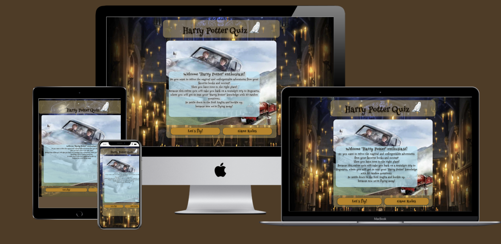
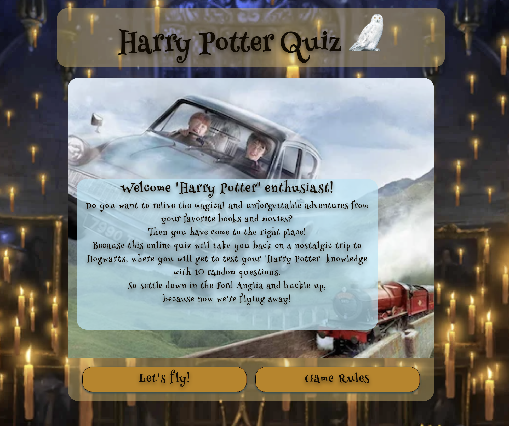
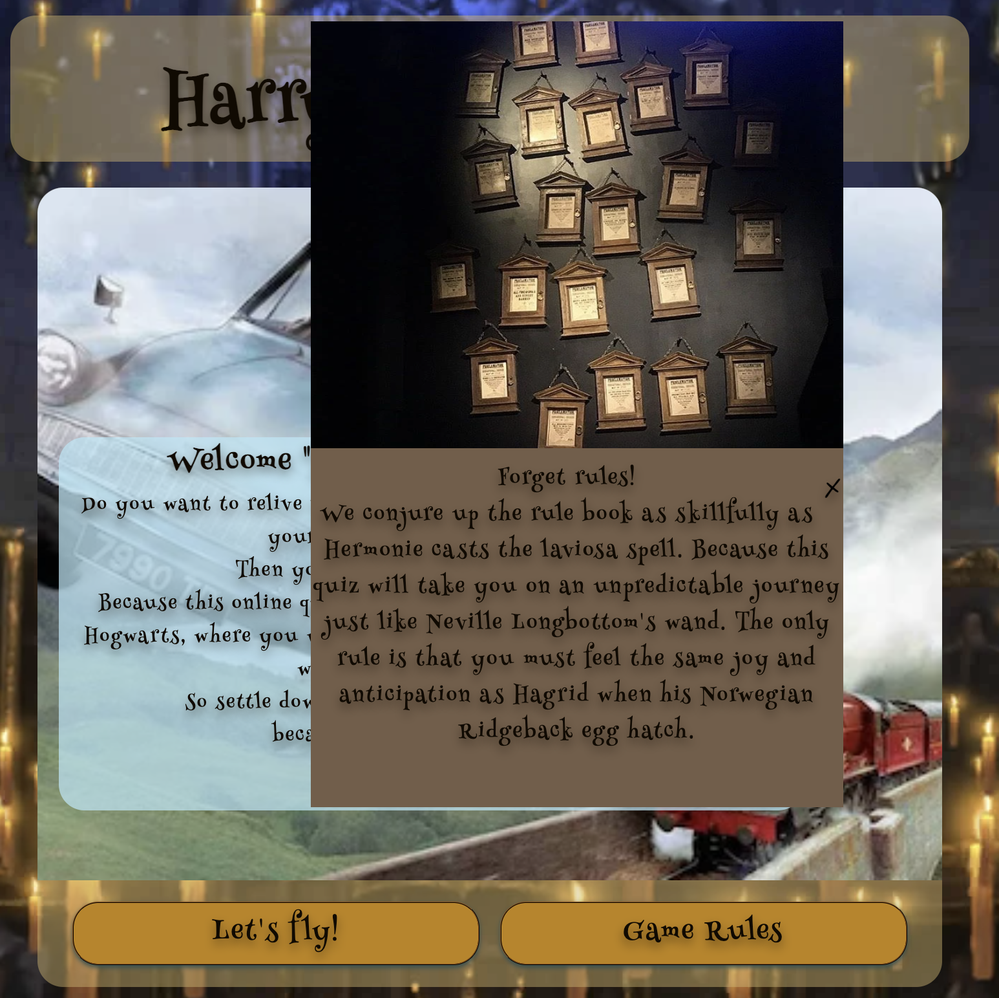
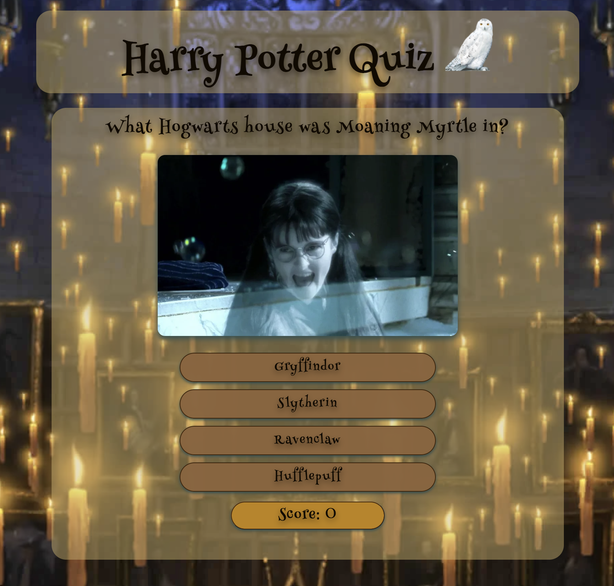
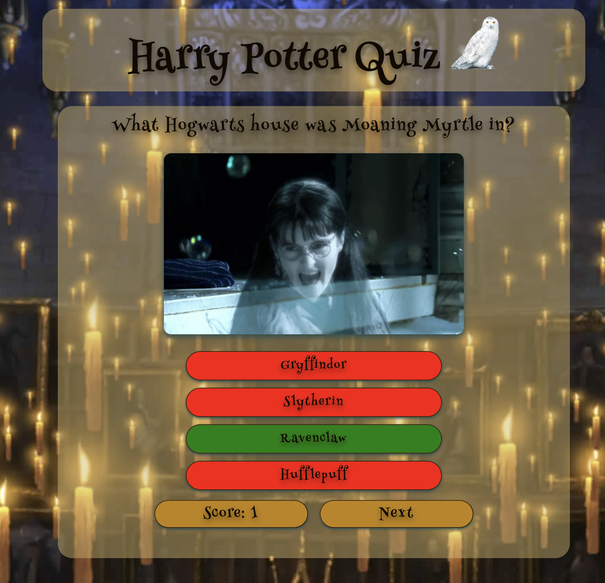
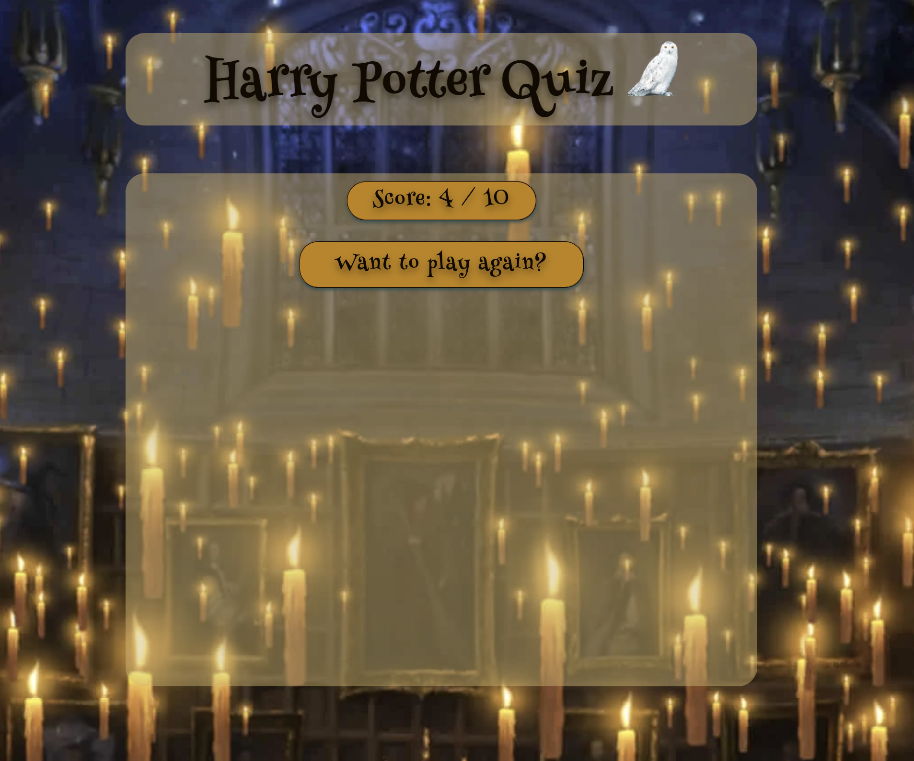
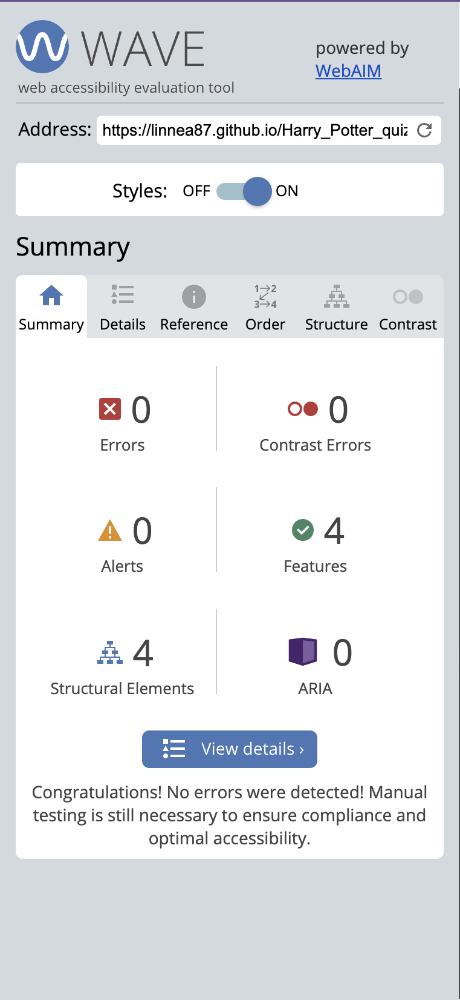
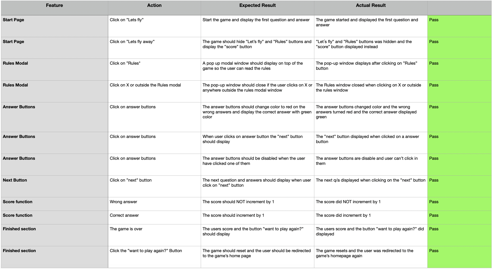

# Harry Potter quiz - Project 2

This is a quiz with 10 random questions about Harry Potter. The page can be found here [Harry Potter Quiz](https://linnea87.github.io/Harry_Potter_quiz_pp2/)

The purpose of this website is partly to create a simple quiz based game, where users get the opportunity to test their Harry Potter knowledge. But even where I get to challenge myself in my knowledge of Html, CSS and JavaScript.

## Project Goals
* Create a game that attracts and inspires the user to want to stay and play.
* Create a game that is responsive on all devises.
* Create a game with no errors
* Create a game for the user to interact with.
* Create a game that is easy for the user to understand.
* Create a game with rulses for the user to read
* create a game where the user can see their scores.

## Design
I wanted to design a Harry Potter game that evokes the feeling of being part of Hogwarts and its magical world. I have chosen colors, images, typograpy and mouse pointer in detail to succeed in creating this feeling for the user. 

### Wireframes
I used wierframes from Balsamiq for this page. These wireframes are rough sketches of how I thought the site could be built to achieve the design I envisioned. Therefore, these sketches may differ from what the actual website looks like.

#### Desktop 

#### Tablet

#### Mobile

### Typhograpy
I chose Henny Penny as the font style as I think it creates the magical feeling I want to achieve.

### The mouse pointer
I wanted the mouse pointer to be a magic wand when playing the game on a laptop or desktop. The cursor I chose is from this page [cursors-4u](https://www.cursors-4u.com). 

### Color
I used the <https://coolors.co> tool where I uploaded the background image to create a color scheme that I have since based on when making my color choices.

## Features

* The game has a question bank with 20 questions. From this array, the game selects ten random questions for the user to answer.

* The game keeps track of the questions that have been asked so the user is not asked the same question twice

* As soon as the user has pressed one of the response options, the buttons will no longer be available. This is so that the user cannot change his mind and click several times on the different answer options.

* If the user answers correctly, that answer option turns green, while the incorrect ones turn red, and vice versa if the user answers incorrectly. For each correct answer to the various questions, the score increases by 1.

* When the user has pressed their answer option, the "next" button is displayed. When the user presses the "next" button, the answer options are cleared and a new question is displayed for the user to answer.

* The game is responsive on all devices.

### Home Section
* When the user gets to the game's homepage, the user sees a clear header with an associated logo/image that tells what the game is called. 

* The user also gets to read about what the game will be about with some anecdotes from the books/films. 

* There is also a Let's fly button and a Rules button. If the user presses the Rules button, a box pops up where the user can read about the rules of the game, also here with anecdotes from the books/films. The code for the rules module is taken from https://www.w3schools.com/howto/howto_css_modals.asp

* If the user presses the Let's fly button, the game starts and the homepage vill be hidden and the questions, answers, score counter and the next bottom will be displayed instead. 

### Rules Section
* When the user clicks on the rules button, the rules become visible in a pop up window.

* Here, the user finds out that there are no rules with anecdotes from the böks/films

* When the user clicks either on X or somewhere outside the rule module, the window closes by itself.

### Game Section
* When the user clicks on the Let's fly button, the game starts and the game's homepage is hidden. 

* Instead, the first question is shown with four answer options and a score counter. 

* When the user clicks on one of the answer options, it turns either red or green.

* If the selected answer is correct, the button turns green and the other three turn red to make it clear that the other answer options are incorrect

* If the selected answer is incorrect, the others that are incorrect also turn red and the correct one turns green to make it clear which answer option was correct.

* When all 10 questions have been answered, the user will be directed to the finished section.

#### Question

#### Selected answer

### Finished Section
* After answering the last question, the user reaches the last page. the total score from the number of answered questions is shown here

* The "want to play again?" button is displayed below the score. When the user clicks on the button, they are returned to the game's home page and given a new opportunity to play again.

## Features to implement

* Adding different messages with associated images when the game is over depending on the user's score.
* Add more questions
* Add a module where the user can enter their name
* Add a 404 page.

## Technologies
* HTML is the main language of this project. CSS for styling in a separate file.
* JavaScript has been used for the quiz.
* The IDE I used has been Gitpod with Code Institutes template.
* Git has been used to regularly adding, committing and pushing code to GitHub.
* All code have been stored at GitHub.
* The project has been deployed through Git Pages.
* Favicon Generator has been used for the Favicons.
* Icon8 has been used for downloading the free favicon image.
* Wireframes have been designed in Balsamiq.

## Deployment
### Adding, committing and pushing code
* All code has been pushed to the repository [Harry_Potter_quize_pp2](https://github.com/Linnea87/Harry_Potter_quiz_pp2)
* All code has been regurlary added, committed and pushed throughout the project.
* The commands being used are `git add <file>`,
  `git commit -m “commit message”` and
  `git push`
* Due to being completely brand new into this tech world, the `git commit -m “commit message”` have gradually improved throughout this project since it was difficult for me to understand the importance of good logging in the beginning.

### GitHub Pages
1. I opened up the repository "Harry_Potter_quiz_pp2" on my profile.
2. I Clicked on 'Settings' and scrolled down to 'Pages'.
3. Then I selected the 'Main Branch' and waited for the page to reload.
4. The page was successfully deployed to GitHub Pages.

## Code Validation
### HTML
[W3C - HTML](https://validator.w3.org/) validator shows no errors or warnings in the index.html file.

### CSS
[W3C - CSS](https://jigsaw.w3.org/css-validator/) validator shows no errors or warnings in style.css file. 

### JavaScript

[Jshint](https://jshint.com/) shows no errors in script.js and questions.js.

* When script.js are tested, Jshint shows that on line 48 and 78 there are one undefined variable. This variable are defined in questions.js and therfore Jshint presents this information. The variable can be found on line 3 in questions.js.

* When questions.js are tested, Jshint shows that on line 3 there are one unused variable. This variable are used in script.js and therfore Jshint presents this information.

### Lighthouse
I used Lighthouse in Chrome Dev when i tested the site for both Mobile and Desktop, and got good result on prestanda for both devices. 

#### Desktop

#### Mobile

### Wave 
The site has been tested in [Wave](https://wave.webaim.org/) with good results No errors or alerts

## Testing

* The website has been tested using the extension "Live Server" throughout the project in the IDE.
* The website has been checked for the responsivnes in different screen sizes with Dev Tools
* The website has also been manually tested by me, my family and friends with diferent devices as tablets, mobiles, laptops and desktops throughout the entire project.
* The website has been tested in different browsers such as Chrome, IE Edge, Firefox, Safari and Opera with no errors. In Safari tho the mouse pointer hade a little black square as background. 

## Bugs
None

## Credits
### Question/Answer
All quiz questions and answers are from [AhaSlides](https://ahaslides.com/sv/blog/40-harry-potter-quiz-questions-and-answers/)

### Code
1. I've been using some code from [WebDev Simplified's Javascript tutorial](https://www.youtube.com/watch?v=riDzcEQbX6k) and [GreatStack's Javascript quiz tutorial](https://www.youtube.com/watch?v=PBcqGxrr9g8) 

2. For a deeper understanding of certain functions I've been using the help from [W3Schools](https://www.w3schools.com/js/default.asp), googled alot and read lots of trheeds about other people's problems similar to my own at [StackOverflow.](https://stackoverflow.com/)

3. Got inspired by the student [Rackstorm](https://github.com/Rackstorm), [PdoyleC](https://github.com/PdoyleC) and [Hujanen91](https://github.com/Hujanen91)

### Images and Icons
* The favicon icon is taken from [icons8](https://icons8.com/icon/set/harry-potter/wired) and has been converted with the [favicon.io](https://favicon.io/favicon-converter/) converter.

*  The q1 image is taken from [harrypotterfanzone](https://www.harrypotterfanzone.com/pictures/mad-eye-moody-demonstrates-the-unforgivable-curses/) 

* The q2 image is taken from [quotev](https://www.quotev.com/story/12951251/Draco-Malfoy-The-Cup-Of-Holy-Sh-/15)

* The q4 image is taken from [snapchat](https://t.snapchat.com/vEE1NbA4)

* The q5 image is taken from [honorshogwarts04](https://honorshogwarts04.files.wordpress.com/2015/09/obliviate-4.jpg?w=640)

* The q6 image is taken from [merchoid](https://www.merchoid.com/media/mf_webp/jpg/media/catalog/product/cache/65c63282a2b3bd0da0ec5b004bcde549/h/a/harrypotter_quidditch_set_9.webp)

* The q12 image is taken from [pinterest](https://www.pinterest.se/pin/671247519454677884/)

* The q18 image is taken from [wizardingworld](https://www.wizardingworld.com/fact-file/characters-and-pets/fang)

* The q7-q11, q13-q17 and q19-q20 images is taken from [wallpapers](https://wallpapers.com/)

* The rules image is taken from [pinterest](https://www.pinterest.se/pin/641622278133693828/)

* The B1-background image is taken from [imgix](https://imgix.bustle.com/rehost/2016/9/13/4e0b261d-8796-4462-86ec-ee29ceb41e1b.png?w=800&fit=crop&crop=faces&auto=format%2Ccompress&q=50&dpr=2)

* The i.webp image is taken from [wallpapers](https://wallpapers.com/)

* The 108743720_max image is taken from [fruugo](https://www.fruugo.se/     hedwig-officiella-harry-potter-kartong-cutout-standee-standup/p-42895913-87507724)

## Acknowledgement
A massive thank you to my mentor Graeme Taylor for providing me good hints, crucial advice, alot of aha-moments when i was stuck,
pep talks in some stressfull moments, but most of all for his hand to hand guiding on how i implement images to my questions!

    

