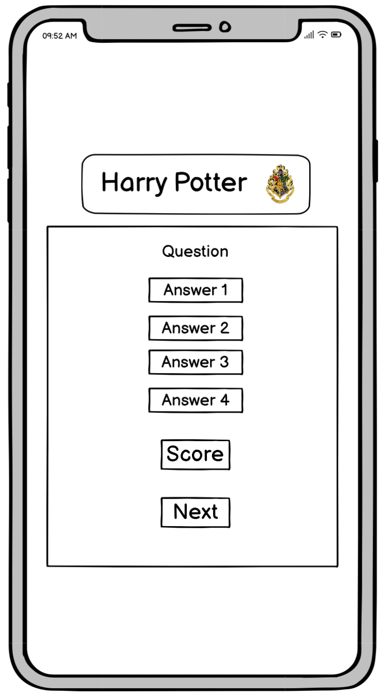

# Harry Potter quiz - Project 2
## Design
### Wireframes
I used wierframes from Balsamiq for this page. These wireframes are just rough sketches of how I thought the page would look and therefore they may differ from how the finished page looks.

#### Desktop 

#### Tablet

#### Phone

### Color
I used the <https://coolors.co> tool where I uploaded the background image to create a color scheme that I have since based on when making my color choices.

## Deployment
### Adding, committing and pushing code
* All code has been pushed to the repository [Harry_Potter_quize_pp2](https://github.com/Linnea87/Harry_Potter_quiz_pp2)
* All code has been regurlary added, committed and pushed throughout the project.
* The commands being used are `git add <file>`,
  `git commit -m “commit message”` and
  `git push`
* Due to being completely brand new into this tech world, the `git commit -m “commit message”` have gradually improved throughout this project since it was difficult for me to understand the importance of good logging in the beginning.

### GitHub Pages
1. I opened up the repository "Harry_Potter_quiz_pp2" on my profile.
2. I Clicked on 'Settings' and scrolled down to 'Pages'.
3. Then I selected the 'Main Branch' and waited for the page to reload.
4. The page was successfully deployed to GitHub Pages.

## Code Validation
### HTML
[W3C - HTML](https://validator.w3.org/) validator shows no errors or warnings in the index.html file.

### CSS
[W3C - CSS](https://jigsaw.w3.org/css-validator/) validator shows no errors or warnings in style.css file. 

### JavaScript

[Jshint](https://jshint.com/) shows no errors in script.js and questions.js.

* When script.js are tested, Jshint shows that on line 48 and 78 there are one undefined variable. This variable are defined in questions.js and therfore Jshint presents this information. The variable can be found on line 3 in questions.js.

* When questions.js are tested, Jshint shows that on line 3 there are one unused variable. This variable are used in script.js and therfore Jshint presents this information.

### Lighthouse

## Credits
### Question/Answer
All quiz questions and answers are from [AhaSlides](https://ahaslides.com/sv/blog/40-harry-potter-quiz-questions-and-answers/)
### Code
### Images and Icons
1. The favicon icon is from [icons8](https://icons8.com/icon/set/harry-potter/wired) and has been converted with the [favicon.io](https://favicon.io/favicon-converter/) converter.

2. The q1 image is from [harrypotterfanzone](https://www.harrypotterfanzone.com/pictures/mad-eye-moody-demonstrates-the-unforgivable-curses/) 

3. The q2 image is from [quotev](https://www.quotev.com/story/12951251/Draco-Malfoy-The-Cup-Of-Holy-Sh-/15)

4. The q4 image is from [snapchat](https://t.snapchat.com/vEE1NbA4)

5. The q5 image is from [honorshogwarts04](https://honorshogwarts04.files.wordpress.com/2015/09/obliviate-4.jpg?w=640)

6. The q6 image is from [merchoid](https://www.merchoid.com/media/mf_webp/jpg/media/catalog/product/cache/65c63282a2b3bd0da0ec5b004bcde549/h/a/harrypotter_quidditch_set_9.webp)

7. The q12 image is from [pinterest](https://www.pinterest.se/pin/671247519454677884/)

8. The q18 image is from [wizardingworld](https://www.wizardingworld.com/fact-file/characters-and-pets/fang)

9. The q7-q11, q13-q17 and q19-q20 images is from [wallpapers](https://wallpapers.com/)

10. The rules image is from [pinterest](https://www.pinterest.se/pin/641622278133693828/)

11. The B1-background image is from [imgix](https://imgix.bustle.com/rehost/2016/9/13/4e0b261d-8796-4462-86ec-ee29ceb41e1b.png?w=800&fit=crop&crop=faces&auto=format%2Ccompress&q=50&dpr=2)

12. The i.webp image are from [wallpapers](https://wallpapers.com/)

    

