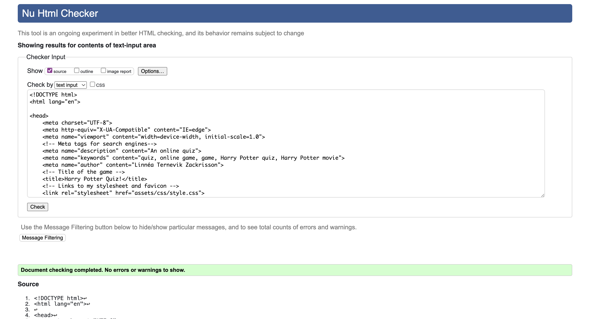
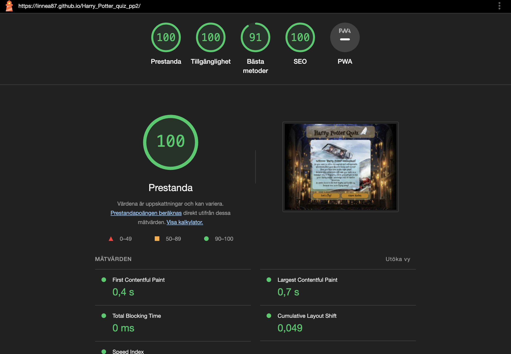

# Harry Potter quiz - Project 2

This is a quiz with 10 random questions about Harry Potter. The page can be found here [Harry Potter Quiz](https://linnea87.github.io/Harry_Potter_quiz_pp2/)

The purpose of this website is partly to create a simple quiz based game, where users get the opportunity to test their Harry Potter knowledge. But even where I get to challenge myself in my knowledge of Html, CSS and JavaScript.

## Project Goals
* Create a game that attracts and inspires the user to want to stay and play.
* Create a game that is responsive on all devises.
* Create a game with no errors
* Create a game for the user to interact with.
* Create a game that is easy for the user to understand.
* Create a game with rulses for the user to read
* create a game where the user can see their scores.

## Design
I wanted to design a Harry Potter game that evokes the feeling of being part of Hogwarts and its magical world in the user. I have chosen colors, images, typograpy and mouse pointer in detail to succeed in creating this feeling for the user. 

### Wireframes
I used wierframes from Balsamiq for this page. These wireframes are rough sketches of how I thought the site could be built to achieve the design I envisioned. Therefore, these sketches may differ from what the actual website looks like.

#### Desktop 

#### Tablet

#### Mobile

### Typhograpy
I chose Henny Penny as the font style as I think it creates the magical feeling I want to achieve.

### The mouse pointer
I wanted the mouse pointer to be a magic wand when playing the game on a laptop or desktop. The cursor I chose is from this page [cursors-4u](https://www.cursors-4u.com). 

### Color
I used the <https://coolors.co> tool where I uploaded the background image to create a color scheme that I have since based on when making my color choices.

## Deployment
### Adding, committing and pushing code
* All code has been pushed to the repository [Harry_Potter_quize_pp2](https://github.com/Linnea87/Harry_Potter_quiz_pp2)
* All code has been regurlary added, committed and pushed throughout the project.
* The commands being used are `git add <file>`,
  `git commit -m “commit message”` and
  `git push`
* Due to being completely brand new into this tech world, the `git commit -m “commit message”` have gradually improved throughout this project since it was difficult for me to understand the importance of good logging in the beginning.

### GitHub Pages
1. I opened up the repository "Harry_Potter_quiz_pp2" on my profile.
2. I Clicked on 'Settings' and scrolled down to 'Pages'.
3. Then I selected the 'Main Branch' and waited for the page to reload.
4. The page was successfully deployed to GitHub Pages.

## Code Validation
### HTML
[W3C - HTML](https://validator.w3.org/) validator shows no errors or warnings in the index.html file.

### CSS
[W3C - CSS](https://jigsaw.w3.org/css-validator/) validator shows no errors or warnings in style.css file. 

### JavaScript

[Jshint](https://jshint.com/) shows no errors in script.js and questions.js.

* When script.js are tested, Jshint shows that on line 48 and 78 there are one undefined variable. This variable are defined in questions.js and therfore Jshint presents this information. The variable can be found on line 3 in questions.js.

* When questions.js are tested, Jshint shows that on line 3 there are one unused variable. This variable are used in script.js and therfore Jshint presents this information.

### Lighthouse
I used Lighthouse in Chrome Dev when i tested the site for both Mobile and Desktop, and got good result on prestanda for both devices. 

#### Desktop

#### Mobile

## Credits
### Question/Answer
All quiz questions and answers are from [AhaSlides](https://ahaslides.com/sv/blog/40-harry-potter-quiz-questions-and-answers/)
### Code
### Images and Icons
* The favicon icon is taken from [icons8](https://icons8.com/icon/set/harry-potter/wired) and has been converted with the [favicon.io](https://favicon.io/favicon-converter/) converter.

*  The q1 image is taken from [harrypotterfanzone](https://www.harrypotterfanzone.com/pictures/mad-eye-moody-demonstrates-the-unforgivable-curses/) 

* The q2 image is taken from [quotev](https://www.quotev.com/story/12951251/Draco-Malfoy-The-Cup-Of-Holy-Sh-/15)

* The q4 image is taken from [snapchat](https://t.snapchat.com/vEE1NbA4)

* The q5 image is taken from [honorshogwarts04](https://honorshogwarts04.files.wordpress.com/2015/09/obliviate-4.jpg?w=640)

* The q6 image is taken from [merchoid](https://www.merchoid.com/media/mf_webp/jpg/media/catalog/product/cache/65c63282a2b3bd0da0ec5b004bcde549/h/a/harrypotter_quidditch_set_9.webp)

* The q12 image is taken from [pinterest](https://www.pinterest.se/pin/671247519454677884/)

* The q18 image is taken from [wizardingworld](https://www.wizardingworld.com/fact-file/characters-and-pets/fang)

* The q7-q11, q13-q17 and q19-q20 images is taken from [wallpapers](https://wallpapers.com/)

* The rules image is taken from [pinterest](https://www.pinterest.se/pin/641622278133693828/)

* The B1-background image is taken from [imgix](https://imgix.bustle.com/rehost/2016/9/13/4e0b261d-8796-4462-86ec-ee29ceb41e1b.png?w=800&fit=crop&crop=faces&auto=format%2Ccompress&q=50&dpr=2)

* The i.webp image is taken from [wallpapers](https://wallpapers.com/)

* The 108743720_max image is taken from [fruugo](https://www.fruugo.se/     hedwig-officiella-harry-potter-kartong-cutout-standee-standup/p-42895913-87507724)

    

